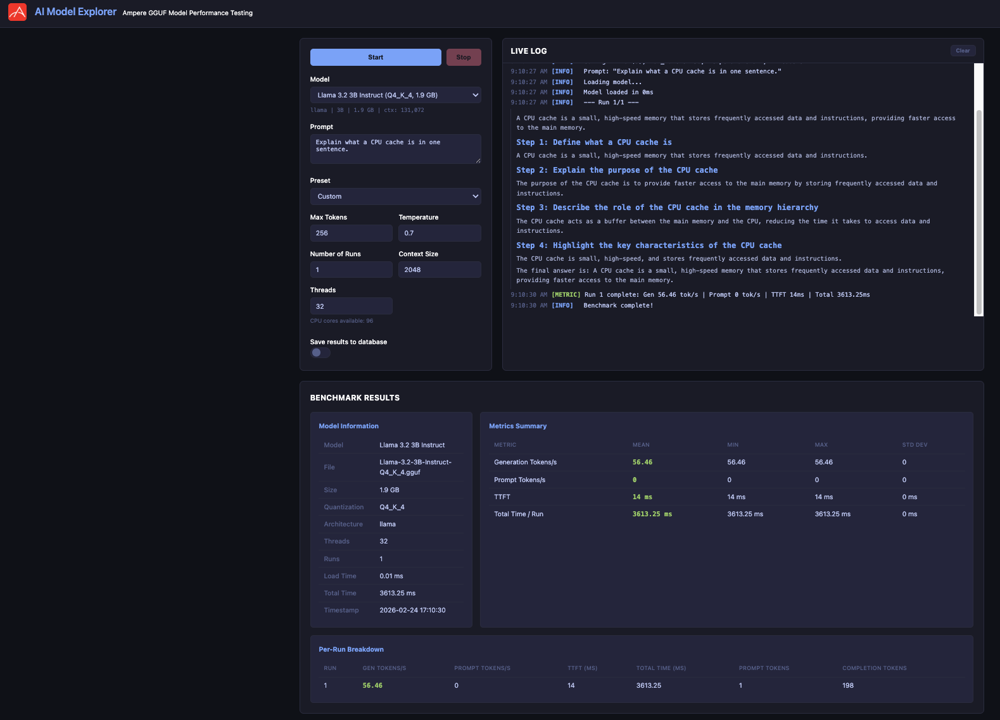
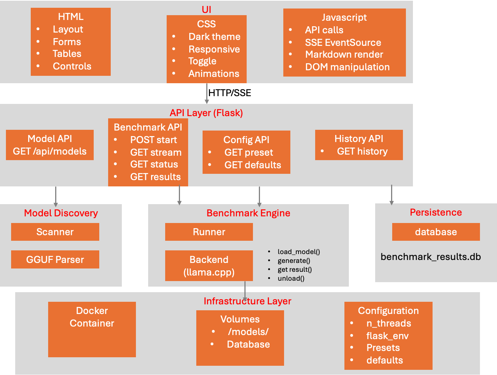
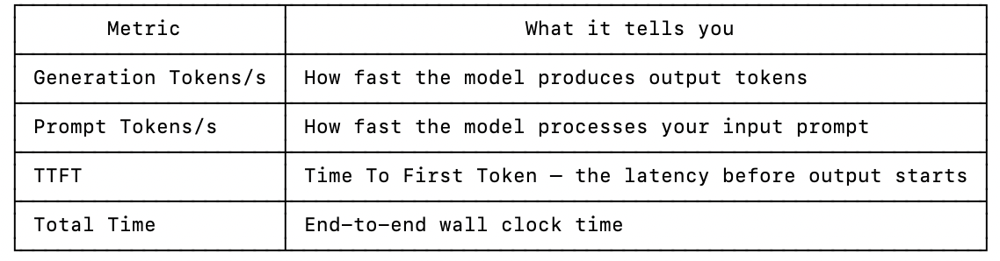
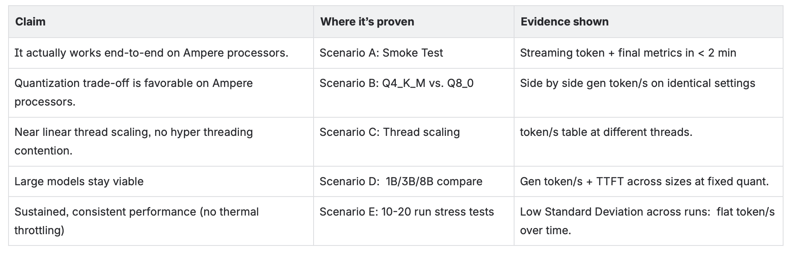
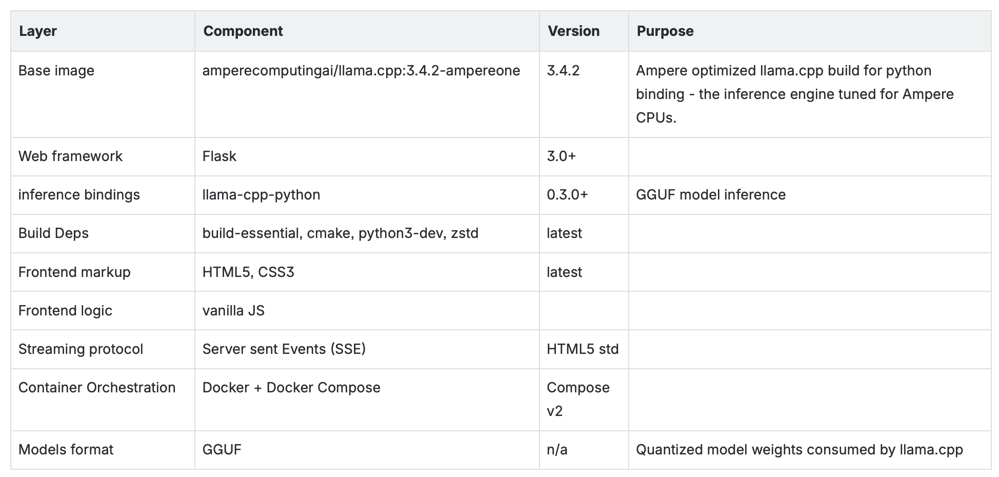

# AI Model Explorers
## User Interface - Web Dashboard
- A single page flask dashboard with three main area:
    - Configuration panel which drives the benchmark:
    - Start/Stop buttons.
    - Model dropdown with a model information readout.
    - Prompt text area.
    - Preset: Custom, Long, Medium, Short.
- Live Log panel which streams logs from the running benchmark with a Clear button.
- Results Section - hidden until a run completes
  - Model Information.
  - Metrics summary.
  - Per-Run  Breakdown table - gen token/s, prompt token/s, TTFT, etc…


## Architectural Diagram
The demo is a GGUF model explorer platform built around a Flask server that drives Ampere optimized llama.cpp inference and streams live results to the browser over SSE.  The architecture diagram captures it in the logical layer below.


## What This Demo Shows
This is a web-based benchmarking platform for testing the performance of AI language models running locally on Ampere processors.

**What it does**

Place GGUF model files (quantized LLMs like Llama 3) in the ./models/ folder, start the app, and use a browser UI to:                  
- Select a model from a dropdown (auto-detected from your local files)
- Enter a prompt (or pick a preset: short/medium/long)
- Configure parameters (max tokens, temperature, threads, number of runs)
- Click Start and watch the model generate text in real-time with markdown rendering

**What it measures**

After each run, it reports these performance metrics:


**Key features**
- Live streaming — tokens appear in real-time as the model generates them, rendered as markdown.
- Native C-level metrics — uses llama.cpp's internal performance counters for accurate throughput numbers (not Python-level timing).
- Model auto-discovery — scans GGUF files and extracts metadata (name, architecture, quantization, context length) from both the filename and binary header.
- Save to database — optionally persist results to SQLite for later comparison and analysis.
- Dockerized — runs in a container built on Ampere's optimized llama.cpp base image.

## Target Audience
AI engineers who want to explore how well different quantized LLMs perform on Ampere CPUs — comparing models (3B vs 8B), quantization levels (Q4 vs Q8), or thread configurations to find the optimal setup.

## Key Message -  What are we trying to convince of?
You're trying to convince that Ampere CPUs are a compelling platform for AI inference — without needing GPUs.

**Core messages**
You can run production-quality LLM inference on AmpereOne, and here are the real numbers to prove it. 

**What the demo proves**
- CPU inference is fast enough: Running a model live and showing generation tokens/s demonstrates that AmpereOne delivers practical, usable inference speeds — not just a demo but something you could deploy.
- Ampere's high core count matters: AmpereOne has up to 192 cores. The thread configuration slider lets you show how throughput scales as you increase threads demonstrating that Ampere's core count directly translates to performance.
- Cost advantage over GPUs: The subtext of every number on screen is: "You're getting this performance without a GPU." GPU instances are expensive and supply-constrained. Ampere offers predictable, lower-cost inference.
- Power efficiency: ARM64 architecture is inherently more power-efficient. The token/s numbers, combined with AmpereOne's TDP, tell a strong performance-per-watt story compared to x86 or GPU alternatives.
- Quantized models run well: Showing Q4 and Q8 quantized models running with solid throughput proves that the combination of efficient quantization + Ampere's architecture is a practical deployment path.
- It just works: The Docker container runs on the amperecomputingai/llama.cpp optimized base image. The demo shows a polished, ready-to-deploy stack — not a research prototype. The message is: "This is production-ready today."

**The conversation it enables**

"If you're paying $X/hour for GPU instances to serve these same models, why not run them on Ampere at a fraction of the cost?"
The live benchmark numbers make that conversation concrete instead of theoretical.

## Proof Points - How does It Show This?
The demo proves Ampere processors are strong CPUs for LLM inference, and it does so with both live evidence during the run and post-run statistical artifacts.  Here’s the breakdown:


## Running the Demo
Step-by-step guide to run he AI Model Explorer demo in Docker.

**Recommended Resources**
- Minimum: 40 cores.  Recommended: 40+ cores
- Minimum: 32GB RAM.  Recommended: 64+ GB RAM
- Minimum: 20GB disk space.  Recommended:  100+ GB (multiple models, large models)

**Software Stack**


**Demo Deployment**
- Install docker
- Git clone from the repo: GitHub - ampere-solution/ampere_optimized_models_benchmark-v1.0: ampere_optimized_models_benchmark version 1.0
- Download and copy GGUF models in the `./models/` directory
- docker-compose.yaml
```yaml
services:
  benchmark:
    cpuset: "0-39"
    image: tinguyen2024/ampere_optimized_models_benchmark:v1.0
    container_name: ampere-benchmark
    ports:
      - "5050:5050"
    volumes:
      - ./models:/app/models
      - ./data:/app/data
    environment:
      - N_THREADS=${N_THREADS:-32}
    restart: unless-stopped
```
- Run 'start_app.sh'. The script will pull the demo docker image from docker hub, setup the environments neccessary for this demo.
- Open the demo at http://< your_ip_address >:5050

**Demo Talking Points**
What is this demo - This is a benchmarking and exploration tool for GGUF LLMs running on Ampere CPUs - no GPU.
Why Ampere for inference (the value prop):
- Single thread per core - no hyper threading contention; each core is dedicated, so scaling is predictable.
- High core counts - LLM inference parallelizes well across cores.
- Power efficient vs. GPU - entire models held in DDR memory, no VRAM ceiling, lower $/token at moderate concurrency.
- Ampere tuned llama.cpp - the base image carries kernels tuned for Ampere processors; same code, materially better token/s than stock builds.

**Stop the Demo**
- Graceful stop
```bash
# stop_app.sh
$ docker compose stop
```
- Remove the demo
```bash
$ docker compose down
```

**Troubleshooting**
```bash
$ docker logs ampere-benchmark
```


